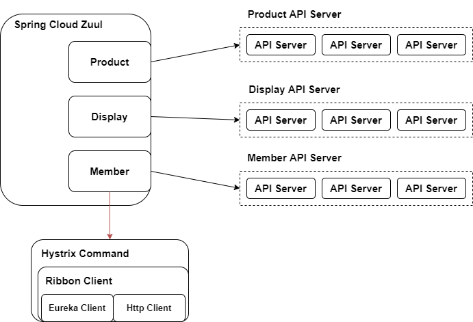

# MSA 사례 : 11번가  

해당 문서는 **11번가 Spring Cloud 기반 MSA로의 전환** 동영상을 보고 정리 한 내용입니다.  
- youtube : https://www.youtube.com/watch?v=J-VP0WFEQsY&t=2493s  

## 목차

- [Why MSA in 11st?](#Why-MSA-in-11st)
- [Hystrix](#Hystrix)
- [Ribbon](#Ribbon)
- [Eureka](#Eureka)  
- [Zuul](#Zuul)  
- [Feign](#Feign)  
- [Service to service call](#Service-to-service-call)
- [Spring cloud config](#Spring-cloud-config)  
- [Monitoring](#Monitoring)  

# Why MSA in 11st

- 초대형 거대 Monolithic system
- 8년 넘게 사용해 온 낙후된 S/W Stack
- 200만 라인의 공통 모듈
- 많은 개발팀의 코드를 한번에 배포  
- IDE에 띄우는 것 조차 버거운 개발 환경  

# MSA 구성  

   

---  

# Hystrix  
Netflix가 만든 Fault Tolerance Library  
=> 장애 전파 방지 & Resilience  

**사용예제**  

```java
// 어노테이션 기반
@HystrixCommand
public String doSomething() {
  // 다른 서버 API Call
}

// HystrixCommand 상속  
public class SampleCommand extends HystrixCommand<String> {
  @Override
  protected String run() {
    // 다른 서버 API Call
  }
}
```

**기능**  

- Circuit Breaker  
  - 메소드의 실행 결과(성공 or 실패)를 기록하고 통계를 낸다(통계에 따라 Circuit open/close).    
  - (1)**일정 시간** 동안 (2)**일정 개수** 이상의 호출이 발생한 경우 (3)**일정 비율** 이상의 에러가 발생하면 Circuit open  
  - (4)**일정 시간 경과** 후에 단 한개의 요청에 대해서 호출을 허용하며(Half Open) 이 호출이 성공하면 Circuit close  
- Fallback  
  - 실패한 경우(Exception) 사용자가 제공한 메소드를 대신 실행
- Thread Isolation  
  - 해당 메소드를 Intercept 하여 다른 스레드에서 실행
- Timeout  
  - 특정시간 동안 메소드가 종료되지 않는 경우 Exception을 발생시킨다.  

**Circuit Breaker의 단위**  
 CommandKey 단위로 통계를 내고 동작  

```java
@HystrixCommand(commandKey = "ExtDep1", fallbackMethod="doSomething11")
public String doSomething1() {
 // 추천 서버 호출 - 상품 추천 #1
}

public String doSomething11() {
  // 미리 준비된 상품 목록
}

@HystrixCommand(commandKey = "ExtDep2")
public String doSomething2() {
 // 추천 서버 호출 - 상품 추천 #2
}
```  

---  

# Ribbon  
Client side의 로드 밸런서  

**주요 인터페이스 및 클래스**  

- Server : host:port 식별자와 같은 서버를 의미
- IPing : 서버 헬스체크
- IRule : 주어진 서버 목록에서 서버를 선택하는데 적용되는 룰
- ServerList<Server> : 대상 서버 목록 제공
- ServerListFilter<Server> : 대상 서버들 중 호출할 대상 Filter  
- ServerListUpdater : 동적 서버 리스트를 위한 인터페이스로 내부적으로 스케줄러가 서버 리스트 조회 후 헬스 체크
- IClientConfig
- ILoadBalancer  

---  

# Eureka  
;Dynamic Service Discovery  
- 등록 : 서버가 자신의 서비스 이름(종류)와 IP 주소, 포트를 등록
- 조회 : 서비스 이름(종류)을 갖고 서버 목록 조회  

  


**특징**  

- Spring의 Life cycle과 같이 이벤트가 발생
- Server 시작 시 Eureka 서버에 자동으로 자신의 상태 등록(UP)  
- 주기적으로 HeartBeat를 보냄
- Server 종료 시 Eureka 서버에 자신의 상태 변경(DOWN) OR 자신의 목록을 삭제  
- Eureka 상에 등록된 이름은 `spring.application.name`  

**With Ribbon**  
하나의 서버에 Eureka client와 Ribbon client가 함께 설정된다면 Spring Cloud는  
아래와 같이 Ribbon Bean을 대체  

- ServerList<Server>  
  - ConfigurationBasedServerList -> DiscoveryEnabledNIWSServerList  
- IPing
  - DummyPing -> NIWSDiscoveryPing  

---

# Zuul  

**MSA에서 API Gateway가 필요한 이유**  
- Single Endpoint 제공  
- API의 공통 로직 구현
  - Logging, Authentication, Authorization
- Traffic Control  
  - API Quota, Throttling  

**Hystrix, Ribbon, Eureka in Spring cloud zuul**  

   

---  

# Feign  
Declarative Http Client  
- Java interface + Spring MVC Annotation 선언으로 http 호출이 가능한  
Spring Bean을 자동 생성  
- OpenFeign 기반의 Spring Cloud 확장  
- Hystrix + Ribbon + Eureka와 연동  

```Java
// Ribbon + Eureka 없이
@FeignClient(name="product", url="http://localhost:8081")
public interface FeignProductService {
  @RequestMapping(path="/products/{productId}")
  String getProductInfo(@PathVariable("productId") String productId);
}

// Ribbon + Eureka
@FeignClient(name="product")
public interface FeignProductService {
  @RequestMapping(path="/products/{productId}")
  String getProductInfo(@PathVariable("productId") String productId);
}
```  

---  

# Service to service call

**Service to Service calls**  

   

- Gateway 사용
  - 모든 API를 통제할 수 있는 장점
  - Single point failover가 너무 큰게 단점

---  

# Spring cloud config  
Git 등으로 Config 관리되며 서버 시작시 Config 서버가 제공하는 Config들이  
PropertySource로 등록  

   

---  

# Monitoring  
